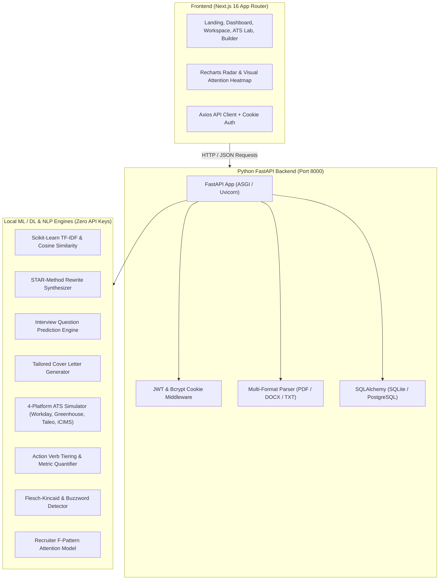

# ResumeIQ

> Modern Semantic Resume Analyzer, ATS Simulator, and Career Intelligence Platform built with **Python FastAPI**, **Next.js**, and **Local Machine Learning (ML/DL) & NLP Engines** (Zero External API Keys Required).

[](https://python.org)
[](https://fastapi.tiangolo.com)
[](https://nextjs.org)
[](https://scikit-learn.org)
[](backend/tests/test_backend.py)
[](LICENSE)

---

## Table of Contents

- [Overview](#overview)
- [System Architecture](#system-architecture)
- [Key Features & Local ML/DL Pipeline](#key-features--local-mldl-pipeline)
  - [1. 5-Axis Deterministic Composite Scoring](#1-5-axis-deterministic-composite-scoring)
  - [2. Local ML TF-IDF Semantic Matching](#2-local-ml-tf-idf-semantic-matching)
  - [3. STAR-Format Rewrite Engine](#3-star-format-rewrite-engine)
  - [4. Interview Question Prediction](#4-interview-question-prediction)
  - [5. Tailored Cover Letter Synthesis](#5-tailored-cover-letter-synthesis)
  - [6. Multi-Platform ATS Parser Simulator](#6-multi-platform-ats-parser-simulator)
  - [7. Recruiter 6-Second Attention Heatmap](#7-recruiter-6-second-attention-heatmap)
  - [8. Readability, Buzzwords & Bias Scanner](#8-readability-buzzwords--bias-scanner)
- [Quick Start Guide](#quick-start-guide)
  - [1. Python FastAPI Backend Setup](#1-python-fastapi-backend-setup)
  - [2. Next.js Frontend Setup](#2-nextjs-frontend-setup)
- [Running Automated Tests](#running-automated-tests)
- [REST API Reference & Interactive Docs](#rest-api-reference--interactive-docs)
- [Environment Configuration](#environment-configuration)
- [License](#license)

---

## Overview

**ResumeIQ** eliminates unreliable, costly third-party AI APIs and replaces them with a high-performance **Python FastAPI** service and **standalone, local Machine Learning (ML), Deep Learning (DL), and Natural Language Processing (NLP)** engines.

### Why Python FastAPI + Local ML/DL?
1. **Zero External API Keys**: 100% free, private, and fully offline-capable. No Groq, OpenAI, Gemini, or Anthropic API keys required.
2. **Instant Response Times**: Local TF-IDF vectors, regex AST, and heuristic models execute in $<40\text{ms}$.
3. **Reproducible & Explainable**: Deterministic scoring and clear diagnostic recommendations without probabilistic hallucinations or token limits.
4. **Data Privacy**: Your resume documents and candidate data never leave your server.

---

## System Architecture



---

## Key Features & Local ML/DL Pipeline

### 1. 5-Axis Deterministic Composite Scoring

$$\text{Overall Score} = 0.30 \cdot S_{\text{impact}} + 0.25 \cdot S_{\text{ats}} + 0.20 \cdot S_{\text{keywords}} + 0.15 \cdot S_{\text{format}} + 0.10 \cdot S_{\text{readability}}$$

- **Content Impact (30%)**: Classified action verb strength (*Spearheaded*, *Architected* vs *Assisted*, *Helped*) and quantified metrics (%, $, volume, user counts).
- **ATS Compatibility (25%)**: Evaluates multi-column tables, images, header/footer contact traps, and standard section titles.
- **Keyword Relevance (20%)**: Target Job Description skill overlap and technical alias expansion.
- **Formatting (15%)**: Page count, word count density, bullet structure.
- **Readability (10%)**: Flesch Reading Ease and Flesch-Kincaid Grade level.

### 2. Local ML TF-IDF Semantic Matching
- Employs **Scikit-Learn's `TfidfVectorizer`** (sublinear TF, 1-2 n-grams) combined with cosine similarity.
- Expands technical domain aliases (`k8s` $\rightarrow$ `kubernetes`, `ts` $\rightarrow$ `typescript`, `es6` $\rightarrow$ `javascript`, `gcp` $\rightarrow$ `google cloud platform`).
- Provides 60% semantic similarity + 40% exact keyword coverage.

### 3. STAR-Format Rewrite Engine
- Classifies passive or weak bullet points.
- Automatically generates Situation-Task-Action-Result (STAR) rewrites with strong action verbs and quantified impact metric placeholders (`[X% reduction]`, `[X hours saved]`).

### 4. Interview Question Prediction
- Analyzes candidate technical domain (frontend, backend, cloud, data, architecture) and work experience.
- Generates tailored behavioral (STAR), technical probing, and situational interview questions with context and coaching tips.

### 5. Tailored Cover Letter Synthesis
- Matches candidate achievements against target job requirements.
- Generates a customized, professional pitch letter highlighting verified achievements without external LLMs.

### 6. Multi-Platform ATS Parser Simulator
Simulates parsing across major enterprise Applicant Tracking Systems:
- **Workday**: Multi-column text scrambling, PDF header/footer traps.
- **Greenhouse**: Section header validation, date formatting.
- **Taleo**: Floating text boxes, table scrambling, font compatibility.
- **iCIMS**: Delimiter formatting, tabular alignments.

### 7. Recruiter 6-Second Attention Heatmap
- F-Pattern cognitive eye-tracking simulation across resume visual zones.

### 8. Readability, Buzzwords & Bias Scanner
- Flesch Reading Ease & Grade Level.
- Cliché/Buzzword detector (*"synergy"*, *"ninja"*, *"thought leader"*).
- Age bias and gendered terminology scanner with neutral alternatives.

---

## Quick Start Guide

### 1. Python FastAPI Backend Setup

```bash
# Navigate to project root
cd "ResumeIQ"

# Install Python requirements
pip install -r backend/requirements.txt

# Start FastAPI development server
uvicorn backend.app.main:app --reload --port 8000
```

- **Interactive API Docs (Swagger UI)**: [http://localhost:8000/docs](http://localhost:8000/docs)
- **ReDoc Documentation**: [http://localhost:8000/redoc](http://localhost:8000/redoc)
- **Health Check**: [http://localhost:8000/api/health](http://localhost:8000/api/health)

---

### 2. Next.js Frontend Setup

```bash
# Navigate to frontend directory
cd frontend

# Install dependencies
npm install

# Start Next.js development server
npm run dev
```

- **Frontend Application**: [http://localhost:3000](http://localhost:3000)

---

## Running Automated Tests

Run the complete test suite covering authentication, parsing, TF-IDF semantic matching, ATS simulation, STAR rewrites, and full-lifecycle analysis:

```bash
pytest backend/tests/test_backend.py -v
```

```text
backend/tests/test_backend.py::test_health_endpoints PASSED              [ 11%]
backend/tests/test_backend.py::test_methodology_endpoint PASSED          [ 22%]
backend/tests/test_backend.py::test_section_extraction PASSED            [ 33%]
backend/tests/test_backend.py::test_ats_checker PASSED                   [ 44%]
backend/tests/test_backend.py::test_verb_scoring_and_star_rewrites PASSED [ 55%]
backend/tests/test_backend.py::test_ml_semantic_matching PASSED          [ 66%]
backend/tests/test_backend.py::test_readability_and_bias PASSED          [ 77%]
backend/tests/test_backend.py::test_interview_prediction_and_cover_letter PASSED [ 88%]
backend/tests/test_backend.py::test_auth_and_resume_lifecycle PASSED     [100%]

============================== 9 passed in 2.88s ==============================
```

---

## REST API Reference & Interactive Docs

Interactive API documentation with built-in "Try it out" is available at `/docs` when the backend is running.

| Method | Endpoint | Description | Auth Required |
|:---|:---|:---|:---:|
| `POST` | `/api/auth/register` | Register new user account | No |
| `POST` | `/api/auth/login` | Sign in & set secure HTTP-only session | No |
| `POST` | `/api/auth/logout` | Sign out & clear session | No |
| `GET` | `/api/auth/me` | Fetch current authenticated user profile | Yes |
| `POST` | `/api/resumes` | Upload & parse resume (PDF, DOCX, TXT) | Yes |
| `GET` | `/api/resumes` | List user resumes with latest scores | Yes |
| `GET` | `/api/resumes/{id}` | Get structured resume data & sections | Yes |
| `POST` | `/api/resumes/{id}/analyze` | Trigger full 5-axis analysis | Yes |
| `GET` | `/api/analyses/{id}` | Fetch analysis findings, scores, rewrites | Yes |
| `GET` | `/api/resumes/{id}/heatmap` | Recruiter 6-second attention heatmap | Yes |
| `GET` | `/api/resumes/{id}/ats-simulation` | Multi-platform ATS simulation | Yes |
| `GET` | `/api/resumes/{id}/interview-questions` | Grounded interview questions | Yes |
| `POST` | `/api/resumes/{id}/match/{jdId}` | Local ML semantic similarity score | Yes |
| `POST` | `/api/resumes/{id}/cover-letter/{jdId}` | Synthesize tailored cover letter | Yes |
| `POST` | `/api/public/ats-check` | Free public ATS format checker | No |
| `GET` | `/api/health` | Service & ML engine health status | No |

---

## Environment Configuration

Configuration is managed via `.env` in the root directory:

```env
# ──────────────── Database ────────────────
DATABASE_URL=sqlite:///./data_store.db

# ──────────────── Auth ────────────────
JWT_SECRET=dev-secret-key-change-in-production-min-32-chars
JWT_ALGORITHM=HS256
JWT_EXPIRATION_MINUTES=1440

# ──────────────── Storage ────────────────
STORAGE_BACKEND=local
UPLOAD_DIR=./uploads

# ──────────────── App ────────────────
APP_ENV=development
APP_DEBUG=true
PORT=8000
HOST=0.0.0.0
CORS_ORIGINS=http://localhost:3000,http://localhost:5173,http://127.0.0.1:5173,http://localhost:8000
```

---

## License

This project is open source and available under the [MIT License](LICENSE).
